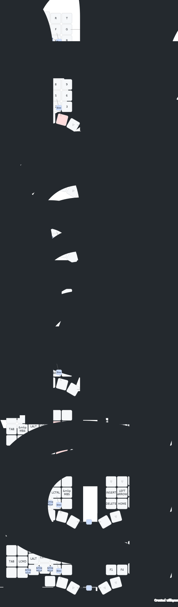

# Charybdis Wireless Mini (Dongle + Display + ZMK) - Assembly & Build Guide

[](https://github.com/Rattus-ukrizovany/charybdis-wireless-mini-trackball-displaydongle/actions/workflows/build.yml)

This guide covers the assembly of the **Charybdis Wireless Mini keyboard** with PMW3610 trackball support and the firmware building process for both **Bluetooth** and **Dongle + Display** configurations.

> 📷 *Photo coming soon*

[Additional project photos](docs/photos/)

---

## Hardware Requirements

### Essential Components

| Component | Notes |
|-----------|-------|
| **nice!nano v2** | Microcontroller – 2 units for keyboard halves, 1 for dongle |
| **MX Switch Sockets** | For hot-swap mechanical switches |
| **Diodes** | 1N4148 signal diodes (1 per key, row-to-col wiring) |
| **PMW3610 Sensor** | Trackball sensor (right half) |
| **Mechanical Switches** | MX-compatible (36 keys) |
| **Keycaps** | Any standard MX keycaps |
| **USB-C Cable** | For flashing and dongle connection |
| **Battery** | See [Battery Recommendations](#battery-recommendations) |

For full bill of materials and assembly instructions, refer to the [Charybdis Wireless Mini Build Guide](https://github.com/280Zo/charybdis-wireless-mini-3x6-build-guide).

### Dongle Display & Sensor

The dongle supports a **1.69" SPI display** (non-touch) for status information and an optional **APDS9960 light sensor**.

- Display can be ordered [here (non-touch version)](https://www.waveshare.com/1.69inch-touch-lcd-module.htm)
- Wiring guide: [`docs/nice_nano_wire_guide.md`](docs/nice_nano_wire_guide.md)

### Case Files

3D-printable case files are available in the `case/` directory:

- **Keyboard halves**: `case/keyboard/`
- **Trackball mount**: `case/trackball/`
- **Dongle case**: `case/dongle/`
- **Keycaps**: `case/keycaps/`

---

## Battery Recommendations

### Right Half Battery (Critical for Trackball)

**IMPORTANT:** The PMW3610 trackball sensor consumes significant power. I **recommend using a 1000mAh** for the right half instead of a standard 130mAh battery.

#### Battery Comparison

| Capacity     | Runtime | Notes |
|--------------|---------|-------|
| **130mAh**   | ~2-3 days | Insufficient for trackball usage|
| **1000mAh**  | ~7-10 days | **Recommended** for trackball configurations |

#### Battery Selection Tips

1. **Form Factor**: Ensure the battery fits within the allocated space in your case
2. **Connector**: Use JST-PH 2.0 connectors for consistency
3. **Quality**: Choose reputable brands (e.g., Adafruit, Sparkfun)
4. **Voltage**: Should be 3.7V nominal (standard LiPo)

#### Left Half Battery

The left half can use a standard **500mAh battery** since it doesn't power the trackball sensor.

### Installation Notes

- Route battery cables through designated paths to avoid pinching
- Use kapton tape to insulate battery connectors
- Secure batteries with double-sided tape or velcro
- Leave enough space for safe removal and replacement
- Never force batteries into tight spaces; modify the case if needed

---

## Building Firmware

### Option 1: Local Build (Recommended for Quick Testing)

The fastest way to build firmware locally is using the containerized Docker build system.

#### Prerequisites

- [Docker](https://docs.docker.com/get-docker/)
- [Docker Compose](https://docs.docker.com/compose/install/)
- This repository cloned on your machine

#### Build Commands

```bash
# Navigate to the local build directory
cd local-build

# Build all firmwares
docker-compose run --rm builder

# Build specific shield (e.g., bluetooth only)
docker-compose run --rm builder -s charybdis_bt

# Enable USB logging for debugging
docker-compose run --rm builder -l true
```

#### Output

The built firmware files will be in `build_output/` organized by build name:

```
build_output/
├── qwerty-bt/
│   ├── charybdis_left.uf2
│   └── charybdis_right.uf2
├── qwerty-dongle/
│   ├── charybdis_left.uf2
│   ├── charybdis_right.uf2
│   └── charybdis_dongle.uf2
└── reset-nanov2/
    └── settings_reset.uf2
```

See the [local build README](local-build/README.md) for more details, including USB logging and troubleshooting.

### Option 2: GitHub Actions (CI/CD Pipeline)

For automatic builds on every push:

1. **Fork or clone** this repository
2. **Push your changes** to GitHub
3. **GitHub Actions** automatically builds your firmware
4. **Download artifacts** from the Actions tab

#### Advantages

- No local toolchain setup required
- Builds run on GitHub servers
- Automatic artifact publishing
- Perfect for collaborative development

#### Disadvantages

- Slower feedback loop (~5-10 minutes per build)
- Requires GitHub account

### Option 3: Download Pre-built Firmware from Releases

For the easiest experience, download pre-built firmware directly from GitHub Releases:

1. **Navigate to the [Releases page](../../releases)**
2. **Download the latest release** - Each release is automatically created on every push to main
3. **Extract the ZIP file** for your desired configuration:
   - `charybdis-qwerty-bt.zip` - Bluetooth build (left and right halves)
   - `charybdis-qwerty-dongle.zip` - Dongle build (left, right, and dongle with display)
   - `charybdis-reset-nanov2.zip` - Settings reset firmware

#### Automatic Release Publishing

This repository automatically publishes firmware releases on every push to `main`:

- **Triggered on every push**: Any push to the `main` branch creates a new release
- **Automatic versioning**: Releases are tagged with date and commit hash (e.g., `v2026.02.10-a1b2c3d`)
- **Includes all variants**: Each release contains all firmware variants (Bluetooth, Dongle, Reset)
- **Change tracking**: Release notes include commit information and author details

---

## Dongle + Trackball + Display Configuration

### Overview

The dongle configuration allows you to use a **wireless USB dongle** that acts as the central device, supporting the **PMW3610 trackball sensor** forwarded wirelessly from the right half and showing status on a **1.69" SPI display**.

### Components Required

- **Dongle** (nice!nano v2 + 1.69" SPI display + optional APDS9960 light sensor)
- **Left and right keyboard halves** (each with nice!nano v2 and battery)
- **PMW3610 trackball sensor** (soldered to right half)
- **USB-C cable** (for dongle connection to computer)
- **Appropriate batteries** (see [Battery Recommendations](#battery-recommendations))

### Configuration Files

| Shield | Location | Purpose |
|--------|----------|---------|
| `charybdis_left` | `boards/shields/charybdis_bt/` | Left half (BT & Dongle builds) |
| `charybdis_right` | `boards/shields/charybdis_bt/` | Right half with PMW3610 |
| `charybdis_dongle` + `dongle_screen` | `boards/shields/charybdis_dongle/` | Dongle with display |

### Building Dongle Firmware

```bash
cd local-build
docker-compose run --rm builder
```

The dongle build (`qwerty-dongle`) automatically includes the `dongle_screen` shield for display support.

---

## Keyboard Layouts

This firmware supports multiple keyboard layouts out of the box:

### Supported Layouts

| Layout | File | Status | Notes |
|--------|------|--------|-------|
| **QWERTY** | `config/keymap/qwerty.keymap` | Active (built by default) | Standard English layout |
| **Polish characters** | `config/keys_pl.h` | Included | Keys available in SYM layer |
| **Russian characters** | `config/keys_ru.h` | Included | Available for custom use |
| **Extra layouts** | `extra-keymaps/` | Reference | Alternate Czech/other layouts |

### Polish Characters

Polish character definitions (`config/keys_pl.h`) are included in the keymap. Polish-specific keys include: Ą, Ć, Ę, Ł, Ń, Ó, Ś, Ź, Ż and their uppercase variants. The `PL_EURO` key and others are accessible from the SYM layer.

### Adding Custom Layouts

To add a new layout:

1. Create a new `.keymap` file in `config/keymap/`
2. Define your key mappings following ZMK syntax
3. Reference any custom key definitions (e.g., `keys_pl.h`, `keys_ru.h`)
4. Build the firmware -- it will automatically detect and build your new layout

---

## Flashing Firmware

### Prerequisites

- Downloaded firmware (`.uf2` files)
- USB-C cable
- One device at a time (repeat for each half/dongle)

### Flashing Steps

1. **Unzip the firmware package**

   ```bash
   unzip charybdis-qwerty-dongle.zip
   ```

2. **Enter bootloader mode**

   - Plug the device into your computer via USB
   - **Double-press the reset button** on the nice!nano v2
   - The device should mount as `NICENANO` storage device

3. **Copy the firmware file**

   ```bash
   # On Windows
   copy charybdis_left.uf2 F:\  # Replace F:\ with your NICENANO drive

   # On macOS/Linux
   cp charybdis_left.uf2 /Volumes/NICENANO/
   ```

4. **Wait for programming**

   - The file will be copied
   - The device will automatically unmount and restart

5. **Repeat for other halves**

   - Repeat steps 2-4 for `charybdis_right.uf2`
   - If using dongle, also flash `charybdis_dongle.uf2`

### First-Time Setup

**Important:** If flashing for the first time or switching between Bluetooth and Dongle configurations:

1. **Flash the reset firmware first** to all devices:

   ```bash
   # Available in firmwares/ directory
   # Flash settings_reset.uf2 to each device
   ```

2. Then proceed with normal firmware flashing

This clears any previous pairing information and ensures a clean state.

### Troubleshooting Flashing

- **Device not mounting**: Try a different USB port or cable
- **Still in bootloader**: Hold reset button while plugging in for 3 seconds
- **File copy fails**: Ensure the drive is properly mounted
- **Device won't restart**: Check the firmware file is not corrupted

---

## Modifying Trackball Behavior

The trackball uses ZMK's modular input processor system. All settings are in `config/charybdis_pointer.dtsi`.

### Current Configuration

```dts
&trackball_listener {
    /* base pointer speed (scaler: 5/5 = 1x) */
    input-processors = <&zip_xy_scaler 5 5>;

    /* SCROLL layer (layer 7): trackball becomes scroll wheel */
    scroller {
        layers           = <7>;
        input-processors = <
            &zip_xy_scaler 1 15               // scroll speed
            &zip_xy_to_scroll_mapper          // convert XY to scroll
            &zip_scroll_transform (INPUT_TRANSFORM_Y_INVERT)
        >;
    };

    /* SLOW layer (layer 6): precision pointer */
    slow_pointer {
        layers           = <6>;
        input-processors = <&zip_xy_scaler 2 6>;  // ~1/3 speed
    };
};
```

### Building After Changes

```bash
cd local-build
docker-compose run --rm builder
```

---

## Customizing Keymaps

### Using ZMK Studio (Bluetooth Only)

[ZMK Studio](https://zmk.studio/) allows real-time keymap editing on supported devices.

1. Build Bluetooth firmware
2. Pair keyboard to computer
3. Open [zmk.studio](https://zmk.studio/) in your browser
4. Connect to keyboard
5. Modify keymaps in real-time

> **Note:** ZMK Studio is supported on Bluetooth builds only. Dongle support is not yet available.

### Using Keymap Editor GUI

[nickcoutsos' keymap editor](https://nickcoutsos.github.io/keymap-editor/) provides a visual interface:

1. Fork/clone this repository
2. Open the keymap editor
3. Give it access to your GitHub repo
4. Select your branch
5. Modify keys visually
6. Save changes (auto-commits and triggers GitHub Actions)
7. Download built firmware

### Direct Keymap Editing

Edit `config/keymap/qwerty.keymap` directly:

```dts
// Add layers, modify behaviors, change keycodes
// See ZMK documentation: https://zmk.dev/docs/features/keymaps
```

---

## Keyboard Layers
### Overview & Usage



To see all the layers check out the [full render](keymap-drawer/qwerty.svg).

| # | Layer      | Display Name  | Purpose                                          |
|---|------------|---------------|--------------------------------------------------|
| 0 | **BASE**   | Rattus        | Standard QWERTY typing                           |
| 1 | **NUM**    | Numbers       | Numbers 0–9, @, brackets, parentheses           |
| 2 | **NAV**    | Media         | Symbols row, media controls, arrows, volume      |
| 3 | **SYM**    | Nav           | Mouse movement/scroll, modifier keys, nav        |
| 4 | **GAME**   | Sym           | Symbols: `~`, `$`, `^`, `+`, `&`, `{}`, `<>` etc.|
| 5 | **EXTRAS** | Xtra          | Bluetooth profiles, brightness, sleep, system    |
| 6 | **SLOW**   | Slow          | Precision (slow) pointer mode                    |
| 7 | **SCROLL** | Scroll        | Trackball → scroll wheel                         |
| 8 | **FUNC**   | Functional    | F1–F12 function keys                             |

### Thumb Cluster (K36–K40)

| Key | Tap         | Hold           |
|-----|-------------|----------------|
| K36 | LEFT_WIN    | LEFT_WIN       |
| K37 | ESC         | NUM layer (1)  |
| K38 | SPACE       | SPACE          |
| K39 | ENTER       | SYM layer (3)  |
| K40 | (none) / hold only | NAV layer (2)  |

### Combos

| Trigger Keys               | Result                                  |
| -------------------------- | --------------------------------------- |
| `K17 + K18`                | **Caps Word** (one-shot CAPS)           |
| `K25 + K26`                | **Left Click**                          |
| `K26 + K27`                | **Middle Click**                        |
| `K27 + K28`                | **Right Click**                         |
| `K16 + K37`                | **Precision mouse** (SLOW layer)        |
| `K38 + K39` (thumb cluster)| Layer-swap **BASE <-> EXTRAS**            |

### Trackball Modes

| Activation               | Mode    | Behavior                              |
|--------------------------|---------|---------------------------------------|
| Hold **X** (K26)         | SCROLL  | Trackball becomes vertical/horizontal scroll wheel |
| Combo **K16 + K37**      | SLOW    | Pointer speed reduced to ~1/3 for precision work   |

### Additional Features

- **Scroll layer (SCROLL / layer 7):** Hold the **X** key (K26) while moving the trackball to turn motion into scroll. Y-axis is inverted for natural scroll feel.
- **Precision cursor mode (SLOW / layer 6):** Activate via combo K16+K37 to reduce pointer speed to ~1/3 for fine-grained cursor control.
- **Bluetooth profile quick-swap:** Jump to the EXTRAS layer and tap the dedicated BT-select keys to pair or switch among up to four saved hosts (plus BT CLR to forget all).
- **PMW3610 low-power trackball sensor driver:** Provided by [280Zo](https://github.com/280Zo/zmk-pmw3610-driver) (fork of badjeff's driver) — patched to remove build warnings and prevent cursor jump on wake.
- **Hold-tap behaviors:** Side-aware hold-tap configurations (`ht_left`, `ht_right`) defined in `behaviors.dtsi` for use in custom keymaps.
- **ZMK Studio:** Supported on Bluetooth builds (`qwerty-bt`) for quick and easy keymap adjustments. Dongle support not yet available.
- **Dongle display:** Powered by [zmk-dongle-screen v0.1.2](https://github.com/janpfischer/zmk-dongle-screen) — shows keyboard status on the 1.69" SPI display connected to the dongle.

---

## Troubleshooting

### Connection Issues

**Problem:** Keyboard halves aren't connecting (Bluetooth)

**Solutions:**
1. Press reset button on both halves simultaneously
2. Follow [ZMK connection troubleshooting](https://zmk.dev/docs/troubleshooting/connection-issues#acquiring-a-reset-uf2)
3. Flash reset firmware to both halves
4. Re-pair from Bluetooth settings

### Trackball Issues

**Problem:** Trackball not moving or erratic movement

**Solutions:**
1. Verify PMW3610 sensor is properly soldered
2. Check pin connections with multimeter
3. Adjust pointer speed in `charybdis_pointer.dtsi`
4. Verify I2C/SPI lines for interference
5. Test with a different sensor if available

**Problem:** Trackball drains battery quickly

**Solutions:**
1. Use 1000mAh or larger battery (see [Battery Recommendations](#battery-recommendations))
2. Lower pointer speed to reduce sensor polling
3. Enable low-power mode if available in firmware
4. Check for sensor firmware updates

### Firmware Issues

**Problem:** Firmware won't flash

**Solutions:**
1. Try different USB port or cable
2. Verify device is in bootloader mode (NICENANO should appear)
3. Check firmware file integrity
4. Update bootloader if needed

**Problem:** Keys not responding

**Solutions:**
1. Test switches individually
2. Verify diodes are installed with correct polarity
3. Check for cold solder joints with a magnifying glass
4. Test with continuity meter
5. Rebuild firmware and re-flash

### Layout Issues

**Problem:** Polish/Russian characters not working

**Solutions:**
1. Ensure you included the correct character definitions file
2. Check keymap is properly configured
3. Verify your system keyboard layout supports these languages
4. Test individual key codes

---

## Credits & References

This project builds upon the excellent work of the ZMK community and specialized contributors:

### Original Projects & Authors

#### Charybdis Keyboard Hardware
- **[280Zo/charybdis-wireless-mini-3x6-build-guide](https://github.com/280Zo/charybdis-wireless-mini-3x6-build-guide)** - Wireless Charybdis keyboard design and assembly guide

#### ZMK Firmware & Dependencies
- **[ZMK Firmware v0.3.0](https://zmk.dev/)** - Modern open-source keyboard firmware for wireless input devices
- **[janpfischer/zmk-dongle-screen v0.1.2](https://github.com/janpfischer/zmk-dongle-screen)** - ZMK dongle with display support (used in `qwerty-dongle` build)
- **[280Zo/zmk-pmw3610-driver](https://github.com/280Zo/zmk-pmw3610-driver)** - PMW3610 trackball sensor driver for ZMK (fork with build warning fixes and wake-up cursor jump prevention)
- **[nickcoutsos/keymap-editor](https://github.com/nickcoutsos/keymap-editor)** - Visual keymap editor for ZMK
- **[caksoylar/keymap-drawer](https://github.com/caksoylar/keymap-drawer)** - Keymap visualization tool
- **[urob/zmk-config](https://github.com/urob/zmk-config)** - Hold-tap behavior inspiration

---

## Additional Resources

- **[ZMK Documentation](https://zmk.dev/docs/)** - Official ZMK guide and API reference
- **[PMW3610 Sensor Specs](https://www.pixart.com.tw/)** - Sensor specifications
- **[nice!nano Pinout](https://nicekeyboards.com/docs/nice-nano/pinout-schematic)** - Pin reference for wiring the display and sensor

---

## Support & Issues

- **Found a bug?** Open an issue on this repository
- **Need help?** Check the troubleshooting section or ask in the ZMK community
- **Have improvements?** Submit a pull request!

---

